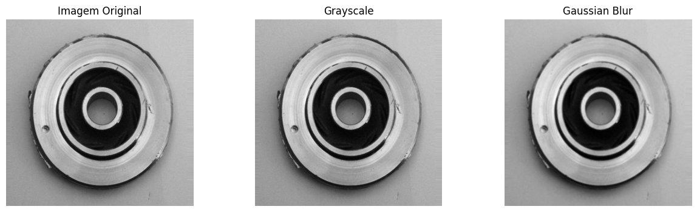
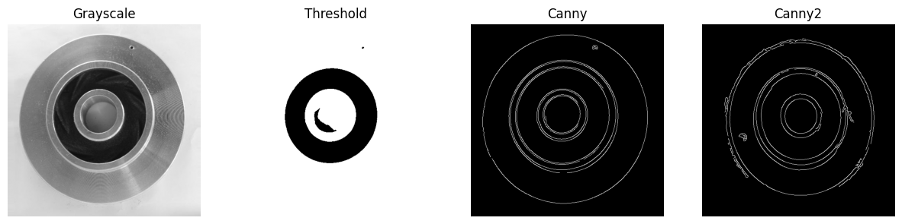
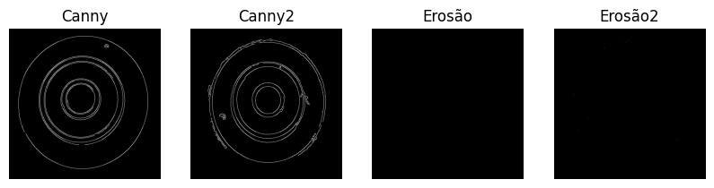
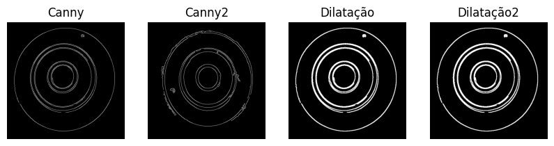
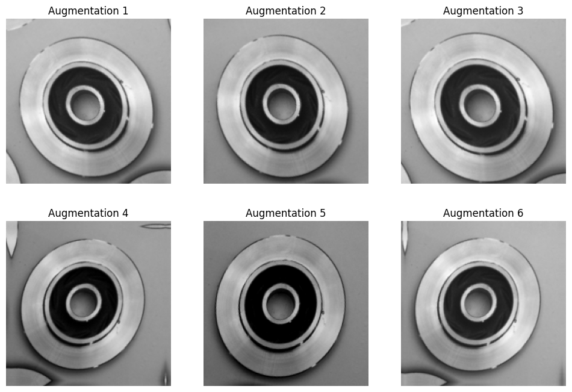
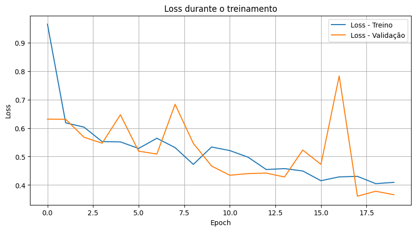
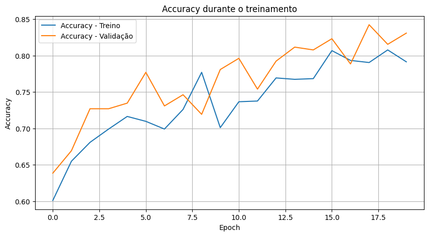

# Machine Learning e Visão Computacional — Inspeção de Peças

## 1. Objetivo

Este projeto tem como objetivo desenvolver um pipeline de inspeção visual de peças metálicas combinando técnicas clássicas de processamento de imagens com aprendizado profundo.

Na primeira etapa, foram utilizadas técnicas de Visão Computacional com OpenCV para realizar uma análise exploratória das imagens, aplicando conversão para escala de cinza, suavização, limiarização, detecção de bordas e operações morfológicas.

Na segunda etapa, foi desenvolvido um classificador utilizando uma Rede Neural Convolucional (CNN) com TensorFlow/Keras, capaz de classificar as peças em duas categorias:

* **OK**
* **Defeituosa**

Também foi utilizado Data Augmentation para simular pequenas variações de posição, zoom e iluminação durante o treinamento.

---

# 2. Dataset

Foi utilizado o dataset **Casting Product Image Data for Quality Inspection**, composto por imagens de peças metálicas destinadas à inspeção de qualidade.

As imagens foram organizadas em duas classes:

```text
def_front/
    → Peças defeituosas

ok_front/
    → Peças OK
```

O conjunto utilizado possui:

* **1.300 imagens**
* **781 imagens defeituosas**
* **519 imagens OK**
* **2 classes**

As imagens foram carregadas automaticamente utilizando `image_dataset_from_directory()`.

---

# 3. Estrutura do Projeto

```text
projeto_tensor_keras/
│
├── def_front/
│   └── imagens de peças defeituosas
│
├── ok_front/
│   └── imagens de peças OK
│
├── assets1/
│   ├── accuracy.png
│   ├── augmentation.png
│   ├── blur1_thereshold1.png
│   ├── blur_thereshold.png
│   ├── canny_dilatacao.png
│   ├── canny_erosao.png
│   ├── gray_thereshold_canny.png
│   ├── loss.png
│   ├── rgb1_gray1_blur1.png
│   └── rgb_gray_blur.png
│
├── funcoes.py
├── main.ipynb
├── requirements.txt
└── README.md
```

O arquivo `main.ipynb` contém o desenvolvimento principal do projeto, incluindo a análise exploratória, preparação dos dados, Data Augmentation, construção da CNN e treinamento.

---

# 4. Sprint 2 — Análise Exploratória Clássica

## 4.1 Grayscale

As imagens foram convertidas para escala de cinza utilizando o OpenCV:

```python
img_gray = cv2.cvtColor(img, cv2.COLOR_BGR2GRAY)
```

As imagens selecionadas do dataset já apresentavam aparência monocromática. Dessa forma, a conversão para Grayscale não produziu uma alteração visual significativa, porém a operação foi realizada para garantir que o processamento trabalhasse explicitamente com uma única matriz de intensidade.

A representação utiliza valores de intensidade entre:

```text
0   → preto
255 → branco
```

## 4.2 Gaussian Blur

Após a conversão para escala de cinza, foi aplicado o Gaussian Blur:

```python
img_blur = cv2.GaussianBlur(img_gray, (5, 5), 0)
```

O objetivo foi suavizar pequenas variações e possíveis ruídos da imagem antes das etapas de extração de características.

Foi utilizado um kernel de `5 × 5` e sigma automático.

### Resultado visual



---

# 5. Sprint 3 — Destaque de Características

Nesta etapa foram aplicadas técnicas para destacar visualmente as regiões associadas aos defeitos.

O pipeline utilizado foi:

```text
Imagem Original
       ↓
Grayscale
       ↓
Gaussian Blur
       ↓
Threshold
       ↓
Canny
       ↓
Operações Morfológicas
```

## 5.1 Threshold

Foi aplicada uma limiarização utilizando:

```python
img_thresh = cv2.threshold(
    img_blur,
    80,
    255,
    cv2.THRESH_BINARY
)
```

O valor `80` foi definido empiricamente durante a análise exploratória.

Esse valor apresentou resultado satisfatório nas imagens analisadas, embora não tenha sido necessariamente o valor ideal para todas as imagens.

A operação pode ser representada como:

```text
intensidade < 80  → 0
intensidade ≥ 80  → 255
```

Dessa forma, regiões com diferentes níveis de intensidade podem ser visualmente separadas.

---

## 5.2 Detecção de Bordas com Canny

Foi utilizado o algoritmo Canny:

```python
img_canny = cv2.Canny(img_blur, 50, 150)
```

O Canny identifica mudanças bruscas de intensidade e, consequentemente, evidencia bordas presentes na imagem.

Nas peças com acabamento mais uniforme, o algoritmo destacou principalmente o defeito localizado na região central.

Nas peças com acabamento mais irregular, também foram observadas bordas adicionais nas regiões externas da peça. Isso ocorre porque o Canny detecta transições de intensidade e não diferencia automaticamente entre um defeito e uma irregularidade de acabamento.

### Resultado visual



---

## 5.3 Erosão

A erosão foi avaliada experimentalmente como operação morfológica:

```python
kernel = np.ones((2, 2), np.uint8)

img_erosao = cv2.erode(
    img_canny,
    kernel,
    iterations=1
)
```

A operação tende a reduzir as regiões claras da imagem.

Nos testes realizados, a erosão reduziu excessivamente as linhas produzidas pelo Canny, chegando a praticamente eliminar algumas das estruturas detectadas.

Por esse motivo, a erosão foi mantida na análise para demonstrar o comportamento da técnica, mas **não foi escolhida para o resultado final do pipeline**.

### Resultado visual



---

## 5.4 Dilatação

A dilatação apresentou um resultado mais adequado:

```python
kernel = np.ones((3, 3), np.uint8)

img_dilatada = cv2.dilate(
    img_canny,
    kernel,
    iterations=1
)
```

A operação reforça as regiões claras detectadas pelo Canny, tornando algumas estruturas mais espessas e contínuas.

Nos testes realizados, o defeito central ficou mais evidente e as bordas ficaram visualmente mais contínuas.

Por esse motivo, a dilatação foi utilizada como a operação morfológica de maior interesse na análise final.

### Resultado visual



---

# 6. Sprint 4 — Ingestão de Dados e Data Augmentation

## 6.1 Ingestão automática do dataset

O dataset completo foi carregado utilizando:

```python
tf.keras.utils.image_dataset_from_directory()
```

Foi utilizada uma divisão de:

```text
80% → Treinamento
20% → Validação
```

Resultado:

```text
1.300 imagens
│
├── 1.040 → Treinamento
└──   260 → Validação
```

Foram utilizadas as configurações:

```text
image_size = (224, 224)
batch_size = 32
seed = 42
```

Assim, cada imagem entregue à CNN possui o formato:

```text
224 × 224 × 3
```

---

## 6.2 Data Augmentation

Foi utilizado Data Augmentation dinâmico:

```python
data_augmentation = tf.keras.Sequential([
    tf.keras.layers.RandomRotation(0.1),
    tf.keras.layers.RandomZoom(0.1),
    tf.keras.layers.RandomBrightness(0.1)
])
```

Foram aplicadas três transformações:

* **RandomRotation** — pequenas variações de rotação;
* **RandomZoom** — pequenas variações de zoom;
* **RandomBrightness** — variações de luminosidade.

As imagens originais não são modificadas permanentemente no disco. As transformações são realizadas dinamicamente durante o treinamento.

O augmentation foi aplicado ao conjunto de treinamento, enquanto o conjunto de validação permaneceu sem essas transformações para representar melhor os dados originais.

### Visualização das transformações



---

## 6.3 Otimização do pipeline

Para melhorar o carregamento dos dados durante o treinamento foram utilizados `cache()` e `prefetch()`:

```python
AUTOTUNE = tf.data.AUTOTUNE

train_ds = train_ds.cache().prefetch(
    buffer_size=AUTOTUNE
)

val_ds = val_ds.cache().prefetch(
    buffer_size=AUTOTUNE
)
```

Esses recursos ajudam a reduzir operações repetidas de leitura e permitem preparar novos batches enquanto o modelo processa os anteriores.

---

# 7. Sprint 5 — Arquitetura CNN e Treinamento

## 7.1 Arquitetura

Foi construída uma CNN utilizando a API `Sequential` do TensorFlow/Keras.

A arquitetura utilizada foi:

```text
Data Augmentation
        ↓
Conv2D — 32 filtros — 3×3 — ReLU
        ↓
MaxPooling2D — 2×2
        ↓
Conv2D — 64 filtros — 3×3 — ReLU
        ↓
MaxPooling2D — 2×2
        ↓
Flatten
        ↓
Dense — 64 neurônios — ReLU
        ↓
Dense — 1 neurônio — Sigmoid
```

Código principal:

```python
model = tf.keras.Sequential([
    data_augmentation,

    conv1,
    pool1,

    conv2,
    pool2,

    flatten,

    dense1,
    output
])
```

---

## 7.2 Conv2D

A primeira camada convolucional utiliza 32 filtros com kernel `3×3`:

```python
tf.keras.layers.Conv2D(
    32,
    (3, 3),
    activation="relu"
)
```

A segunda utiliza 64 filtros:

```python
tf.keras.layers.Conv2D(
    64,
    (3, 3),
    activation="relu"
)
```

As camadas convolucionais são responsáveis por aprender características espaciais das imagens.

---

## 7.3 MaxPooling2D

Foram utilizadas duas camadas:

```python
tf.keras.layers.MaxPooling2D(
    (2, 2)
)
```

O MaxPooling reduz a dimensão espacial das características extraídas, preservando as ativações mais relevantes.

---

## 7.4 Flatten

A camada:

```python
tf.keras.layers.Flatten()
```

transforma os mapas de características tridimensionais em um vetor unidimensional, permitindo a conexão com as camadas densas.

---

## 7.5 Camadas Dense

Foi utilizada uma camada intermediária:

```python
tf.keras.layers.Dense(
    64,
    activation="relu"
)
```

A camada final possui um único neurônio:

```python
tf.keras.layers.Dense(
    1,
    activation="sigmoid"
)
```

Como o problema possui duas classes, a saída sigmoid produz um valor entre 0 e 1 para a classificação binária.

A correspondência das classes é:

```text
0 → def_front
1 → ok_front
```

---

## 7.6 Parâmetros do modelo

O modelo apresentou:

```text
Total de parâmetros: 11.963.457
Parâmetros treináveis: 11.963.457
```

A maior parte dos parâmetros está concentrada na camada `Dense` após o `Flatten`.

---

# 8. Compilação

O modelo foi compilado utilizando:

```python
model.compile(
    optimizer="adam",
    loss="binary_crossentropy",
    metrics=["accuracy"]
)
```

### Optimizer

Foi utilizado o **Adam**, conforme solicitado pela tarefa.

### Loss

Foi utilizada a **Binary Crossentropy**, adequada para classificação binária com saída sigmoid.

### Métrica

Foi utilizada **Accuracy** para acompanhar a proporção de classificações corretas.

---

# 9. Treinamento

O treinamento foi realizado durante 20 épocas:

```python
history = model.fit(
    train_ds,
    validation_data=val_ds,
    epochs=20
)
```

Foram acompanhadas:

```text
accuracy
loss
val_accuracy
val_loss
```

---

# 10. Resultados e Auditoria

## 10.1 Loss

A Loss de treinamento apresentou uma redução geral de aproximadamente:

```text
0,96 → 0,41
```

A Loss de validação apresentou uma redução geral de aproximadamente:

```text
0,63 → 0,37
```

Durante o treinamento ocorreram algumas oscilações. A maior delas ocorreu na Epoch 17, quando a `val_loss` subiu temporariamente para aproximadamente `0,78`, mas caiu novamente para aproximadamente `0,36` na Epoch 18.

Não foi observada uma separação progressiva e persistente entre `loss` e `val_loss`.

### Gráfico de Loss



---

## 10.2 Accuracy

A Accuracy de treinamento evoluiu aproximadamente de:

```text
60,1% → 79,1%
```

Enquanto a Accuracy de validação evoluiu aproximadamente de:

```text
63,9% → 83,1%
```

O melhor resultado de validação foi obtido na Epoch 18.

### Gráfico de Accuracy



---

## 10.3 Melhor resultado

O melhor resultado de validação foi:

```text
Epoch 18

Val Accuracy: 84,23%
Val Loss:     0,3607
```

Na última época:

```text
Epoch 20

Val Accuracy: 83,08%
Val Loss:     0,3660
```

| Métrica          | Melhor resultado | Última Epoch |
| ---------------- | ---------------: | -----------: |
| **Val Accuracy** |       **84,23%** |       83,08% |
| **Val Loss**     |       **0,3607** |       0,3660 |

---

# 11. Análise de Overfitting

O comportamento das curvas foi analisado comparando treinamento e validação.

Não foi observada uma situação de overfitting persistente na qual:

```text
Loss de treino ↓ continuamente

enquanto

Loss de validação ↑ continuamente
```

As duas perdas apresentaram uma tendência geral de redução, embora com algumas oscilações ao longo das épocas.

A queda temporária da `val_loss` na Epoch 17 foi seguida por recuperação na Epoch 18, indicando que não se tratou de uma deterioração progressiva da generalização.

Dessa forma, considerando as 20 épocas analisadas, o treinamento apresentou comportamento **predominantemente saudável**, sem evidência clara de overfitting persistente.

---

# 12. Conclusão

O projeto demonstrou a integração entre técnicas clássicas de Visão Computacional e aprendizado profundo para inspeção automatizada de peças metálicas.

Na análise exploratória, as técnicas de Grayscale, Gaussian Blur, Threshold e Canny permitiram destacar características visuais relacionadas aos defeitos. Também foram testadas operações morfológicas, com a dilatação apresentando resultado mais adequado que a erosão para as imagens analisadas.

Na etapa de aprendizado profundo, o dataset foi carregado automaticamente e dividido entre treinamento e validação. Foi utilizado Data Augmentation com variações geométricas e de luminosidade para aumentar a variedade dos dados de treinamento.

A CNN foi construída utilizando `Conv2D`, `MaxPooling2D`, `Flatten` e `Dense`, com Adam como otimizador e Binary Crossentropy como função de perda.

O melhor resultado obtido no conjunto de validação foi de **84,23% de acurácia**, com `val_loss` de **0,3607**, alcançado na Epoch 18.

A análise dos gráficos de Loss e Accuracy não apresentou sinais de overfitting persistente durante as 20 épocas avaliadas.

---

# 13. Tecnologias utilizadas

* Python
* OpenCV
* TensorFlow
* Keras
* NumPy
* Matplotlib
* Jupyter Notebook
* Git
* GitHub

---

# 14. Organização por Sprints

### Sprint 1 — Configuração e Versionamento

* Configuração do ambiente;
* Criação do repositório Git;
* Download e organização do dataset;
* Versionamento do projeto.

### Sprint 2 — Análise Exploratória

* Grayscale;
* Gaussian Blur;
* Análise visual das imagens.

### Sprint 3 — Destaque de Características

* Threshold;
* Canny;
* Erosão;
* Dilatação.

### Sprint 4 — Ingestão e Augmentation

* `image_dataset_from_directory`;
* Divisão treino/validação;
* Redimensionamento;
* Data Augmentation;
* Cache e Prefetch.

### Sprint 5 — CNN e Treinamento

* Conv2D;
* MaxPooling2D;
* Flatten;
* Dense;
* Sigmoid;
* Adam;
* Binary Crossentropy;
* Treinamento por 20 épocas.

### Sprint 6 — Auditoria e Entrega

* Gráficos de Loss e Accuracy;
* Análise de Overfitting;
* Documentação;
* Preparação da apresentação em vídeo.

---

# 15. Arquivos principais

```text
main.ipynb
```

Notebook contendo o desenvolvimento completo do projeto.

```text
funcoes.py
```

Arquivo destinado às funções auxiliares utilizadas no projeto.

```text
requirements.txt
```

Lista das dependências necessárias para executar o projeto.

```text
assets1/
```

Pasta contendo os resultados visuais utilizados na documentação, incluindo as etapas de processamento OpenCV, Data Augmentation e os gráficos de treinamento.
